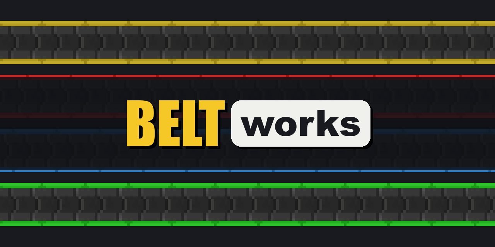

> **Want spline belts?** Those are **Simple Conveyor Belts** by Rearth, the mod Beltworks started from: [GitHub](https://github.com/Rearth/SimpleBelts) · [CurseForge](https://www.curseforge.com/minecraft/mc-mods/simple-conveyor-belts). Beltworks is a different mod, with belts laid on the block grid.

Beltworks adds Factorio-style belts to Minecraft, laid block by block on the grid and built to work with any tech mod. It runs on **NeoForge** for **Minecraft 26.1.2**. It is early work, so please report any issues you find.

## Features

- **Tiles merged into transport lines.** A belt is laid one tile per block, one belt item per tile, facing the way you look. Tiles feeding one another join into a transport line that moves as one, around corners and up and down slopes. A tile holds eight items, so a line is a buffer as well as a route, and when its end backs up you can see the items waiting.
- **One gesture lays a whole stretch.** Sneak-click a tile item to start a stretch, sneak-click again to add an anchor, then click where it ends. The stretch is laid, and paid for, in one go, and goes round a block in its way. While you aim, the Placement Preview draws what the click would lay, in red where it would be refused.
- **Slopes, and crossing over a line.** A line climbs or descends one block per block of travel. A stretch changes height only where you press Raise (`G`) or Lower (`B`), so you cross a line by raising, adding an anchor past it, and lowering.
- **Tiers.** Transport belts, splitters, feeders and loaders come in four tiers, carrying 15, 30, 45 and 60 items a second. Each piece caps only its own flow, so a line of mixed tiers runs at its slowest piece.
- **Splitters.** A splitter takes two belts in and sends two belts out, splitting evenly and sending everything to one side when the other backs up. Build balancers from them.
- **Works with any tech mod, through the loader.** A loader set against any inventory, vanilla or modded, pulls items from it onto the belt or pushes them into it. Right-click a loader with an item to filter what it moves; FTB Filters' smart filters work too.
- **Feeders, one belt for a row of machines.** A feeder moves items one at a time from what its head reaches to what its tail reaches: a chest, a machine, or any level tile along a line, which runs on past it. Its head also picks up items lying on the ground, and its tail never drops items loose: with nowhere to put them, it waits. Each arm reaches one, two or three blocks, over whatever stands between; press Head Reach (`H`) or Tail Reach (`J`) on a held feeder or while aiming at a placed one, and the tail can turn left or right. Feeders come in the four tiers, moving 1.5, 3, 4.5 and 6 items a second, and take a filter the way a loader does.
- **Dismantle.** Sneak-click a line's tile with a wrench or a pickaxe, then click another tile of the same line: everything between them comes up with its items.

## Dependencies

None beyond NeoForge. Groundworks, the library that plans and previews placements, comes inside the jar.

## Credits

Beltworks builds on Simple Conveyor Belts by Rearth and on malcolmriley's unused-textures, both CC BY 4.0. See [NOTICE](NOTICE) for the full credits, and [LICENSE](LICENSE) for how each file is licensed.
